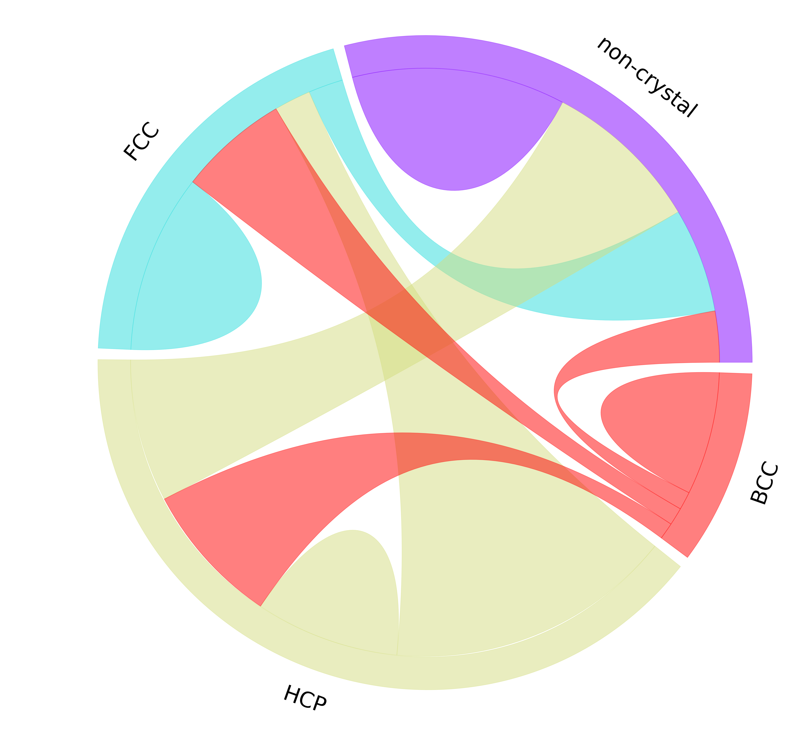

# matplotlib-chord-diagram
plot chord diagram with matplotlib

## Main plot function
```python
def chordDiagram(X, ax, colors=None, cmap='rainbow', width=0.1, pad=2, chordwidth=0.7):
    """Plot a chord diagram
    
    Parameters
    ----------
    X :
        flux data, X[i, j] is the flux from i to j
    ax :
        matplotlib `axes` to show the plot
    colors : optional
        user defined colors in rgb format. Use function hex2rgb() to convert hex color to rgb color. Default: d3.js category10
    cmap : optional
        user defined matplotlib color map (name in string). Default: 'rainbow'. 
    width : optional
        width/thickness of the ideogram arc
    pad : optional
        gap pad between two neighboring ideogram arcs, unit: degree, default: 2 degree
    chordwidth : optional
        position of the control points for the chords, controlling the shape of the chords
    """
```
## Example
An example can be found at the end of `matplotlib-chord.py`. Here is what the figure looks like:

