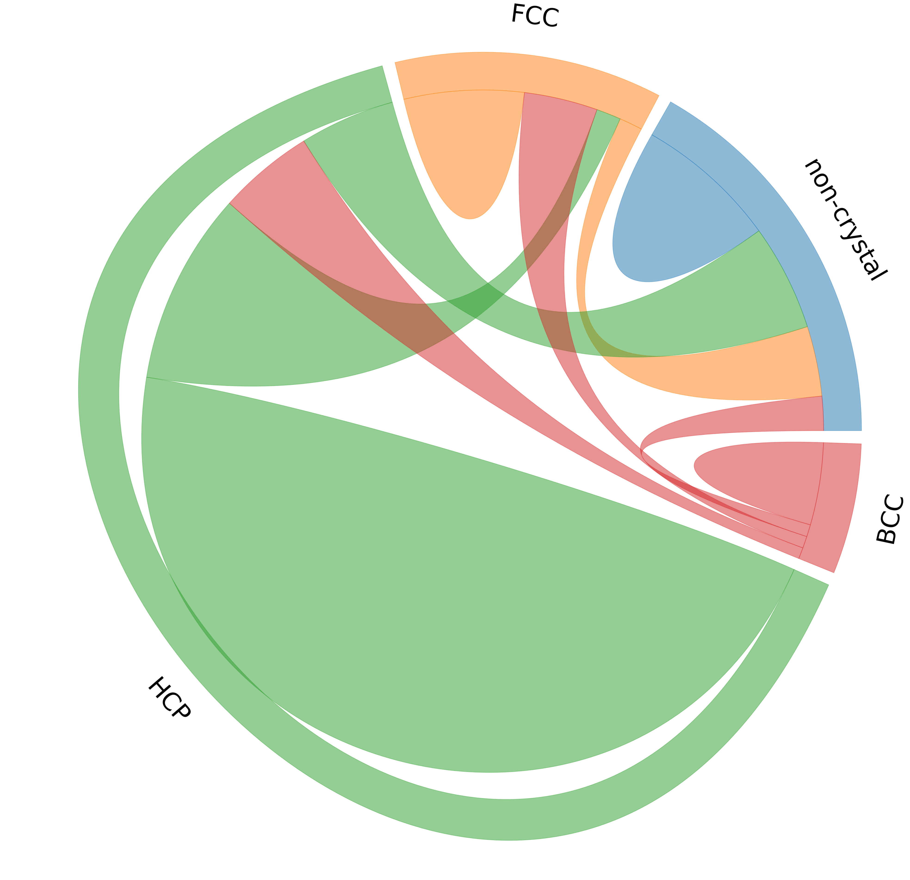

# matplotlib-chord-diagram
plot chord diagram with matplotlib

## Main plot function
```python
def chordDiagram(X, ax, colors=None, width=0.1, pad=2, chordwidth=0.7):
    """Plot a chord diagram
    
    Parameters
    ----------
    X :
        flux data, X[i, j] is the flux from i to j
    ax :
        matplotlib `axes` to show the plot
    colors : optional
        user defined colors in rgb format. Use function hex2rgb() to convert hex color to rgb color. Default: d3.js category10
    width : optional
        width/thickness of the ideogram arc
    pad : optional
        gap pad between two neighboring ideogram arcs, unit: degree, default: 2 degree
    chordwidth : optional
        position of the control points for the chords, controlling the shape of the chords
    """
```

## Example
An example can be found at the end of `matplotlib-chord.py`. Here is what the figure looks like:


## Improvements
Fixes inaccurate circle plotting caused by too few vertices on the Bézier curves. This effect becomes visible when arc lengths exceed 90 degrees, but gets much worse when arc lengths exceed 180 degrees. 

Vertex count has been quadrupled, using four curves on each arc to ensure plotting remains accurate even with long arcs within the dataset.

## Comparison
The effect is visible even with the default arc lengths. 


The effect is much worse with arcs above 180 degrees in length, like in the example image. 


